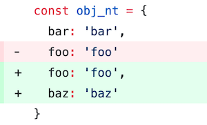
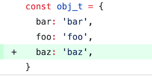

<!--meta
title: 코딩 컨벤션 업무를 하며 알게 된 것들
description: 코딩 컨벤션, 스타일가이드를 만들며 알게된 내용에 대해 정리한 글.
keywords: 코딩 컨벤션, ESLint, StyleGuide
-->

# 코딩 컨벤션 업무를 하며 알게 된 것들 - 2

이전 글에 이어서 Javascript 코딩 컨벤션 관련 업무를 하며 [ESLint](https://eslint.org/) 규칙을 통해 알게 된 점을 정리해 보았습니다.

1. no-prototype-builtins
2. no-return-await
3. comma-dangle

## 1\. no-prototype-builtins

[ESLint: no-prototype-builtins](https://eslint.org/docs/rules/no-prototype-builtins) 규칙은 Object.prototype의 builtin으로 제공되는 메서드를 객체에서 직접 호출하지 않도록 하는 규칙입니다. Object.prototype의 builtin 메서드는 `hasOwnProperty`, `isPrototypeOf` 등이 있고 다음과 같은 방법으로 호출할 수 있습니다.

1. 객체에서 직접 호출하는 방법
2. Object.prototype 을 이용하여 호출하는 방법

```js
const obj = {
  name: 'joah',
}

//  1. 객체에서 직접 호출
obj.hasOwnProperty('name'); // true

// 2. Object.prototype을 이용해 호출
Object.prototype.hasOwnProperty.call(obj, 'name'); // true
```

no-prototype-builtins 규칙에서 객체에서 builtin 메서드를 직접 호출하지 않도록 하는 이유는 다음과 같습니다.

1.  **Object.create(null)**
    
    ECMAScript 5.1에서 추가된 Object.create 메서드에 null을 인자로 주어 객체를 생성하게 되면 Object.prototype을 상속받지 않게 됩니다.
    
    ```js
     const obj = Object.create(null);
     obj.name = 'joah';
    
     obj.hasOwnProperty; // undefined
     obj.hasOwnProperty('name'); // Uncaught TypeError
     Object.prototype.hasOwnProperty.call(obj, 'name'); // true
    ```
    
    따라서 위와 같이 Object.create(null)로 만든 객체에서 builtin 메서드를 직접 호출하게 된다면 에러를 발생시킵니다.
    
2.  **속성이 builtin 메서드를 감추는 경우**
    
    객체에 builtin으로 제공되는 메서드와 같은 이름의 키를 객체가 가지고 있다면 예상한 대로 동작하지 않을 수 있습니다.
    
    ```js
     const badJSON = {
       'hasOwnProperty': '1',
       'name': 'joah'
     }
    
     // ...
    
     badJSON.hasOwnProperty('name'); // Uncaught TypeError
     Object.prototype.hasOwnProperty.call(badJSON, 'name'); // true
    ```
    
    예를 들어 위와 같이 악의적인 클라이언트가 builtin 메서드를 감춘 형태의 JSON을 보내는 경우, 객체에서 직접 메서드를 사용해 처리한다면 에러를 발생시킬 수 있습니다.
    이런 이유로 no-prototype-builtins 규칙은 builtin 메서드 사용시 Object.prototype을 활용하도록 권합니다.
    

## 2\. no-return-await

[ESLint: no-return-await](https://eslint.org/docs/rules/no-return-await) 규칙은 `async function` 내부에서 `return await`을 하지 않도록 하는 규칙입니다. 예를 들어 다음과 같은 경우 입니다.

```js
async function getSomePromise() {
  /* ... */
}

async function asyncCall() {
  // ...
  return await getSomePromise(); // no-return-await 규칙에 걸린다.
}
```

이 규칙에서 `return await`을 잡아내는 이유는 async 키워드를 붙힌 function은 promise를 반환하기 때문입니다.

```js
async function getSomePromise() {
  /* ... */
}

async function asyncCall() {
  // ...

  // (1) promise가 fulfill 되기를 기다렸다가, 값을 반환함
  return await getSomePromise();
  // (2) async로 선언되었기 때문에 promise가 반환됨
}

/* 어디선가 asyncCall()을 호출할 때, */.
// ...

// (3) promise가 fulfill 되기를 기다렸다가, 값을 반환함
const value = await asynCall();

// ...
```

위 코드를 보면 (1), (3)이 중복되는 과정이라는 것을 알 수 있습니다.

```
(1). async function 내부에서 await으로 promise가 fulfill 되기를 기다린 후
(2). fulfill된 값을 다시 promise로 감싸서 반환하고,
(3). asynCall()을 사용하는 곳에서 await으로 promise가 fulfill 되기를 기다리게 됩니다.
```

비록 성능상에 큰 차이가 발생하지는 않지만 불필요한 작업이기 때문에 ESLint에서 걸러낼수 있는 규칙으로 제공하고 있습니다.
하지만 이 규칙에서도 return await을 허용하는 경우가 있습니다.

```js
async function getSomePromise() {
  /* ... */
}

async function asyncCall() {
  try {
    return await getSomePromise();
  } catch (e) {
    // ...
  }
}
```

바로 위와 같이 `try catch`로 return await을 감쌀 때입니다. await 뒤에 온 promise가 reject될 경우 Error를 throw 합니다. 그리고 그 에러 처리를 try catch를 통해 async 함수 내부에서 처리할 수 있습니다. 때문에 no-return-await 규칙을 사용하더라도 try catch로 감싼 경우는 통과하게 됩니다.

## 3\. comma-dangle

[ESLint: comma-dangle](https://eslint.org/docs/rules/comma-dangle) 규칙은 [trailing-comma](https://developer.mozilla.org/ko/docs/Web/JavaScript/Reference/Trailing_commas)를 사용하도록 설정할 수 있는 규칙입니다. trailing-comma는 object나 array의 값, function의 매개변수 등을 나타낼 때 마지막에 콤마(,)를 하나 더 추가하는 것을 뜻합니다. 아래는 trailing-comma의 예시 입니다.

```js
const obj = {
  foo: 'foo',
  bar: 'bar', // 콤마(,)가 추가 되어있다.
}

// 매개변수 마지막에 콤마(,)가 추가되어 있다.
function func(a, b, ) {} 
```

처음에 규칙을 사용하기만 할 때는 단순한 스타일을 일치시키기 위한 용도인 줄만 알았습니다. 하지만 trailing-comma를 사용함으로써 얻는 장점이 있습니다.
여러 줄로 이루어진 값을 수정할 때, 삭제/추가해야 할 줄만 수정할 수 있다는 점 입니다. 이 장점 덕분에 형상관리 툴에서 수정사항을 비교하기 쉽습니다.

-   trailing-comma를 사용하지 않았을 때

    

-   trailing-comma를 사용했을 때

    

위와 같이 형상관리 툴의 diff 기능 이용시, trailing-comma를 사용하지 않는다면 콤마가 추가된 라인까지 수정으로 표시됩니다.
trailing-comma를 사용시 추가, 삭제가 된 라인만 표시되게 되어 더 깔끔한 비교 결과를 확인할 수 있습니다.

-   IE6/7/9 Quirks mode 에서는 trailing-comma 가 문제를 일으킬 수 있습니다.
