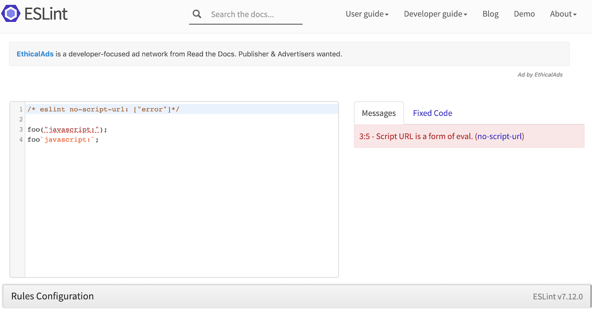
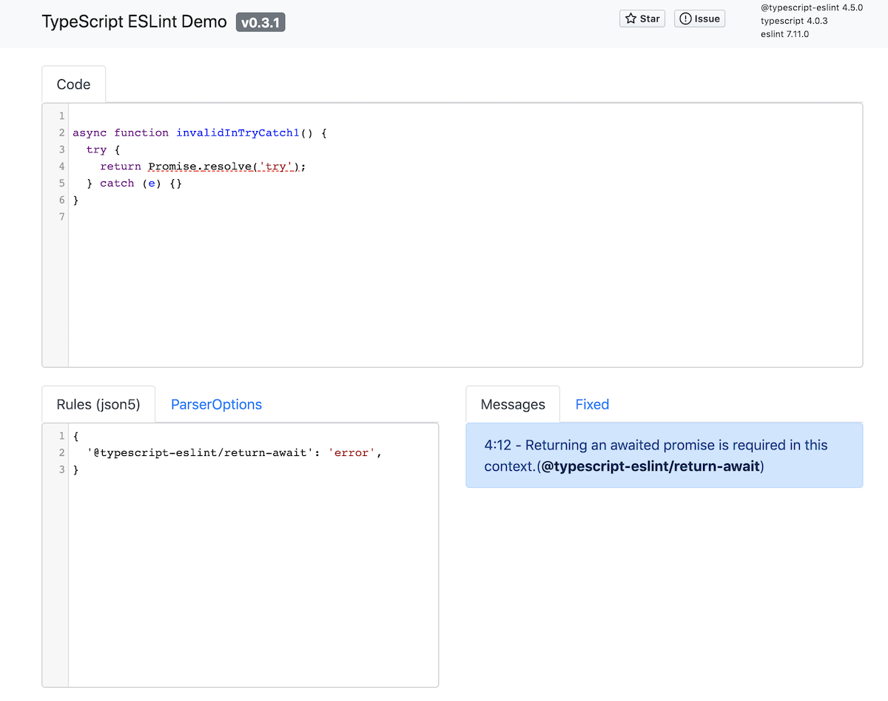

# node 패키지 브라우저에서 사용하기 (with Webpack 4)

웹팩을 사용해서, `fs`, `path`와 같은 NodeJS Built-In 모듈을 사용하는 패키지를 브라우저에서 동작하도록 땜질식(?)으로 번들링해본 후기입니다.  
간단한 결론만 원하신다면 [Summary](#summary) 를 참고하세요.


## 이유

근래에 TypeScript에 흥미를 느껴 [typescript-eslint](https://github.com/typescript-eslint/typescript-eslint) 프로젝트에 조금씩 컨트리뷰션을 하고 있습니다.
컨트리뷰션을 하기 위해 해결할 이슈를 재현해 보곤 하는데, 매번 이슈를 재현하기 위해 프로젝트의 테스트 코드를 찾아서 수정하는 것이 귀찮게 느껴졌습니다.

ESLint에서는 이를 위해 [Online Demo](https://eslint.org/demo)를 제공하고 있는데 이슈를 재현하고 공유할 때 유용하게 사용됩니다. 


이에 typescript-eslint 를 지원하는 웹 데모를 만들어 보면 좋겠다고 생각하였고 이를 만들며 겪었던 문제점과 해결 방법을 정리해 보았습니다. 

## 문제점

typescript-eslint를 브라우저에서 동작시키기 위해서는 typescript-eslint 프로젝트뿐만 아니라 eslint 도 브라우저에서 동작시켜야 합니다. 하지만 해당 프로젝트들은 NodeJS 에서 동작하는 패키지이고 브라우저에서 동작을 지원하지 않습니다.

NodeJS 의 `fs`, `path` 와 같은 built-in 모듈을 사용하는 패키지를 웹팩을 이용해 번들해야 했는데 번들시 해당 모듈을 찾지 못해 아래와 같은 에러가 발생하게 됩니다.

```
ERROR in ./node_modules/@eslint/eslintrc/lib/config-array-factory.js
Module not found: Error: Can't resolve 'fs' in '...project/node_modules/@eslint/eslintrc/lib'
```

결국 번들링을 해서 사용하기 위해서는 NodeJS built-in 모듈을 사용하는 모듈을 별도로 처리해 주어야 했습니다.

처리해야 할 모듈은 런타임에 따라 아래 두 가지 경우로 나눌 수 있었습니다.

1. NodeJS Built-In 모듈을 사용하지만, 런타임에는 필요없는 모듈
2. NodeJS Built-In 모듈을 사용하고, 런타임에도 필요한 모듈

## 해결 1. 런타임에 필요 없는 모듈

번들 결과에서 실제로 런타임에는 필요가 없는 모듈이 있는데, 예를 들어 ESLint에서 CLI 동작을 담당하는 모듈이 있습니다. 이 모듈은 브라우저 데모 동작시에는 실제로 동작할 필요가 없습니다.

이 경우 [웹팩 - null-loader](https://webpack.js.org/loaders/null-loader/) 를 사용하면 해당 모듈을 빈 모듈로 변경할 수 있습니다.

먼저 `null-loader` 를 설치합니다.

```
$ npm install null-loader --save-dev
```

이후, 웹팩 설정의 `rules` 에 아래와 같이 `null-loader`를 추가해 줍니다. `test`에는 비어있는 모듈로 교체할 모듈을 명시해 줍니다.

- [webpack.config.js](https://github.com/yeonjuan/typescript-eslint-demo/blob/master/webpack.base.config.js#L20-L34)

    ```js
    module.exports = {
      rules: [
        //...
        {
          test: [
            /\/eslint\/.*\/cli-engine/,
            // ...
          ],
          use: "null-loader"
        }
      ]
    }
    ```

번들시 `null-loader` 에 `test` 에 설정한 모듈은 비어있는 모듈이 됩니다. 아무런 기능이 없는 모듈이 번들되게 되지만 실제로 런타임에는 사용되지 않기 때문에 동작에 아무런 문제가 되지 않습니다.

## 해결 2: 런타임에도 필요한 모듈

null-loader 를 사용해 대부분의 번들링 에러를 회피할 수 있었습니다 하지만 런타임에 실제로 사용되는 모듈에 null-loader 를 사용하면 실제 코드 동작시에 에러가 발생하게 됩니다.

typescript-eslint 에서는 설정에 따라 tsconfig.json 파일의 경로를 반환하는 용도로 [globby](https://www.npmjs.com/package/globby)를 사용하고 있었고, globby 는 내부에서 `fs` 를 사용하고 있습니다. 때문에 typescript-eslint 를 번들시  globby 에서 `fs`를 찾지 못한다는 에러가 발생하게 됩니다.

 - [@typescript-eslint/parser](https://github.com/typescript-eslint/typescript-eslint/blob/90a587845088da1b205e4d7d77dbc3f9447b1c5a/packages/typescript-estree/src/parser.ts)
    ```ts
    import { sync as globSync } from 'globby';

    //...
    function prepareAndTransformProjects() {
      //...
      globSync([...globbedProjects, ...ignoreListInput], {
        cwd: extra.tsconfigRootDir,
      });
    }
    ```

이 경우 [NormalModuleReplacementPlugin](https://webpack.js.org/plugins/normal-module-replacement-plugin/)를 사용할 수 있습니다. NormalModuleReplacementPlugin 은 웹팩 번들시에 특정 모듈을 내가 정의한 커스텀 모듈로 교체해 사용할 수 있습니다

먼저 해당 모듈을 대체해서 동작할 모듈을 간단하게 작성합니다.(Node Built-In 을 사용하는 패키지를 목킹한다고 생각하면 됩니다)
 
- [/src/modules/globby.js](https://github.com/typescript-eslint/typescript-eslint/blob/90a587845088da1b205e4d7d77dbc3f9447b1c5a/packages/typescript-estree/src/parser.ts#L2)

  ```js
  // src/modules/globby.js
  module.exports = {
    sync() {
      return ["./tsconfig.json"];
    },
  };
  ```

이후 웹팩 설정에서 `plugins` 에 NormalModuleReplacementPlugin로 해당 모듈을 대체할 커스텀 모듈로 대체합니다.

- [webpack.config.js](https://github.com/yeonjuan/typescript-eslint-demo/blob/master/webpack.base.config.js#L76-L78)

  ```js
  const webpack = require('webpack');

  module.exports = {
    //...
    plugins: [
      new webpack.NormalModuleReplacementPlugin(
        /globby/, // 교체 대상 모듈
        "src/modules/globby.js" // 대신 사용할 모듈
      ),
    ]
  }
  ```

이제 웹팩으로 번들시 typescript-eslint 내부에서 import 해서 사용하는 globby 는 제 프로젝트에 있는 `src/modules/globby.js` 로 대체되게 됩니다.

## 결론

결론적으로 위와 같은 과정(삽질?) 을 통해 [typescript-eslint-demo](https://github.com/yeonjuan/typescript-eslint-demo)를 완성하게 되었습니다.



사이드 프로젝트였고 어찌 되었든 동작하는 것이 가장 큰 목표였기 때문에 위와 같은 삽질을 하게 되었는데요.

정리해 놓고 보니 간단하지만 실제 과정은 녹록친 않았습니다. eslint, tyescript-eslint 내부에 어떤 모듈에서 Node Built-In 모듈을 사용하는지 파악하는게 어려웠기 때문에 매번 번들링을 시도하면서 에러가 발생하면 실제 코드를 찾아보고 `null-loader` 나 `NormalModuleReplacementPlugin` 으로 땜질(?)하듯이 작업해야 했습니다.

작업 결과뿐 아니라 유지 보수 관점에서도 단점이 있는데요. 번들할 패키지가 의존하는 모듈에 의존적인 웹팩설정이기 때문에, 패키지 업데이트에 많이 취약하다는 단점이 있습니다. 

> typescript-eslint 에서 구조 리팩터링이 있다면 ... 웹팩을 다시 설정해야겠죠..?

때문에 실제 업무였다면 좀더 좋은 방법을 찾아보았을 것 같습니다.

어찌 되었든 완성된 Online Demo 를 [ESLint 메인테이너분도 사용해 주시기도 하고](https://github.com/eslint/eslint/issues/13758#issuecomment-709353258), [저도 이슈를 재현하고 사용자와 공유하는데](https://github.com/typescript-eslint/typescript-eslint/issues/2703#issuecomment-715685452) 사용중이라 만든 보람은 느껴지는 프로젝트였습니다.

## Summary

`fs`, `path` 와 같은 NodeJS 모듈을 사용하는 패키지를 웹팩으로 번들하는 경우, 런타임에 필요없는 모듈은 [null-loader](https://webpack.js.org/loaders/null-loader/), 런타임에도 필요한 모듈은 [NormalModuleReplacementPlugin](https://webpack.js.org/plugins/normal-module-replacement-plugin/) 를 활용해 보세요. 
